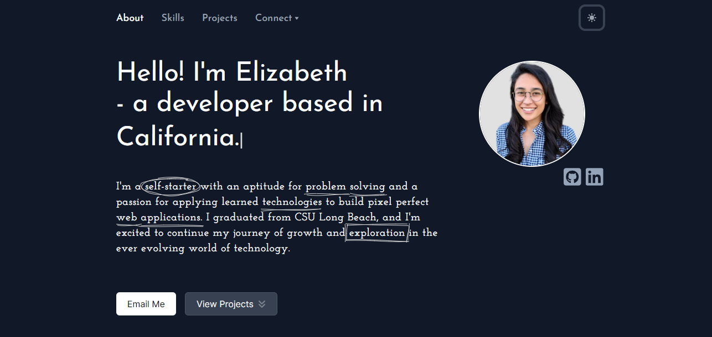

# Elizabeth's Portfolio

## Overview
I conceived the design of this portfolio in Figma and implemented it using Next.js and TypeScript. Throughout the development journey, I familiarized myself with NPM, exploring its wide array of packages. I seamlessly integrated a variety of these packages into the project's framework and tailored them to harmonize with my design vision.

:point_right: Head over to [elizabeth-trotter.com](https://www.elizabeth-trotter.com) to see more.

## Dark Mode Preview

